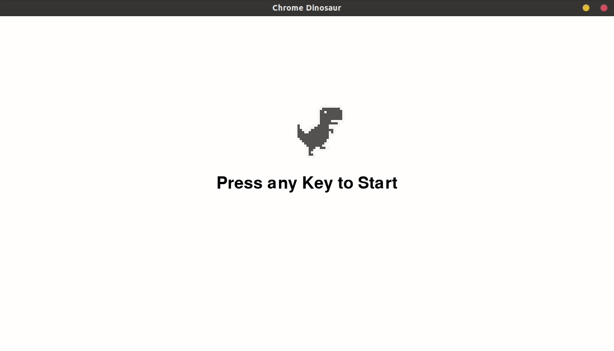

# Chrome Dinosaur
A recreated version of the Dino game in python.

## Installation

Make sure you have Python installed alongside with [pygame](http://www.pygame.org/) library

## Usage

Run main.py
```bash
python3 main.py 
```
## Controls
* Press Up Arrow to jump
* Press Down Arrow to duck
* Avoing hitting obstacles (Bird & Cactus)
